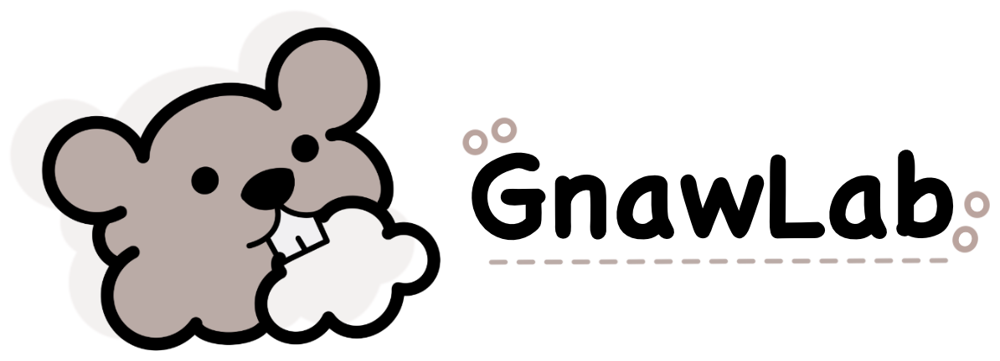
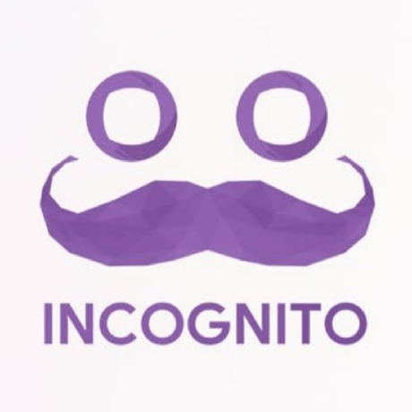

# ialleejy

**이종윤 / Jong-Yun Lee** 
Security Researcher at 

웹·클라우드 보안을 연구하고, 연구 환경과 CTF 인프라를 만듭니다

[Portfolio](https://jongcoding.github.io/) · [LinkedIn](https://www.linkedin.com/in/jongyun-lee-753747122/) · [Blog](https://ialleejy.tistory.com/) · [Email](mailto:ialleejy@gmail.com)

## 주요 기록

- **DEF CON 34 CTF 결승 참가** / The Seoul Sauna Shogunate / [예선 기록](https://ctftime.org/event/3205/)
- **DEF CON 34 Demo Labs 공동 발표** / GnawLab / [발표 정보](https://info.defcon.org/defcon34/content/66504)

## 프로젝트

### [MSGCTF Cloud Platform](https://github.com/MSG-CTF)

여러 클라우드의 자원을 묶어 팀별로 격리된 CTF 실행 환경을 제공하는 플랫폼을 개발 중입니다 
아키텍처 설계, 서비스 간 API 계약 검토, PR 리뷰와 연동 검증을 맡고 있습니다

### [GnawLab](https://github.com/Beaver-Dam-Community/GnawLab)

실제 AWS 침해 사례를 Terraform으로 재현하는 오픈소스 보안 실습 프로젝트입니다 
AWS Bedrock Agent 시나리오에 기여하고 DEF CON 34 Demo Labs에서 공동 발표했습니다

### [WEAVE](https://github.com/WHS-webao/semantic_gap)

웹 구성 요소가 같은 입력을 다르게 해석할 때 발생하는 취약점을 정리한 연구입니다 
원인별 분류 체계 설계와 사례 정리를 맡았습니다 / [사이트](https://semanticgap.mjsec.kr/) · [웹 저장소](https://github.com/WHS-webao/WHS-webao.github.io)

## 활동

- **[ INC0GNITO CTF](https://github.com/Incognito-CTF/incognito-ctf.github.io)** / 2026년 운영 총괄과 예선·본선 문제 출제
- **[ MJSEC](https://github.com/MJSEC-MJU)** / 명지대학교 보안동아리 창립자·초대 회장, 멘토링과 대회 운영

명지대학교 정보통신공학 졸업 / 화이트햇 스쿨 3기

[프로젝트와 활동 기록](ARCHIVE.md) · [전체 포트폴리오](https://jongcoding.github.io/)
